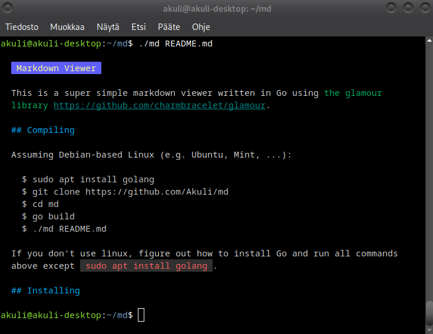

# Markdown Viewer

This is a super simple markdown viewer written in Go
using [the glamour library](https://github.com/charmbracelet/glamour).




## Compiling

On Linux with `apt`:

```
$ sudo apt install golang
$ git clone https://github.com/Akuli/md
$ cd md
$ go build
$ ./md README.md
```

If you don't use linux or you don't have apt,
install Go in whatever way works for you
instead of running `sudo apt install golang`.


## Installing

Once you have compiled `md`, simply copy the executable to some location on your PATH.
For example:

```
$ cp md ~/bin/
```

Now you can run `md somefile.md` in any directory.
